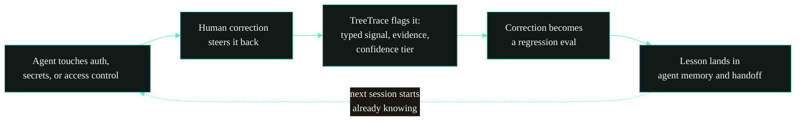

<div align="center">

<picture>
  <source media="(prefers-color-scheme: dark)" srcset="https://raw.githubusercontent.com/Tree-Trace/treetrace/main/.github/assets/logo-dark.svg">
  
</picture>

<h3>Git shows what changed. TreeTrace shows how you steered the agent.</h3>

<p><b>The corrections you make to an AI agent are the highest-signal data in the session, and they vanish when it ends. TreeTrace captures them locally as deterministic regression and eval data, with no LLM judge.</b></p>

<p>
  <a href="https://www.npmjs.com/package/treetrace"></a>
  <a href="https://github.com/Tree-Trace/treetrace/actions/workflows/ci.yml"></a>
  <a href="LICENSE"></a>
  
  
  
</p>

<p>
  <a href="#install">Install</a> &nbsp;&middot;&nbsp;
  <a href="#why-it-exists">Why</a> &nbsp;&middot;&nbsp;
  <a href="#security-regression-memory">Security</a> &nbsp;&middot;&nbsp;
  <a href="#outputs">Outputs</a> &nbsp;&middot;&nbsp;
  <a href="#mcp-server">MCP</a> &nbsp;&middot;&nbsp;
  <a href="examples/">Examples</a> &nbsp;&middot;&nbsp;
  <a href="https://treetrace.dev">treetrace.dev</a>
</p>

<picture>
  
</picture>

</div>

## Install

```bash
cd your-project
npx treetrace
```

Node.js 18 or newer. TreeTrace ships with no runtime dependencies, so `npx treetrace` needs nothing else installed. No accounts, no uploads, no telemetry. Your transcripts never leave your machine.

<table>
<tr>
<td width="33%" valign="top">

**Security regression memory**

Flags the moment an agent weakened auth, leaked a secret, or skipped a test, and turns the human correction into a regression eval the next agent has to pass.

</td>
<td width="33%" valign="top">

**Deterministic eval data**

Real corrections become model-agnostic eval and regression cases. No LLM judge anywhere; every label carries evidence text and source node IDs.

</td>
<td width="33%" valign="top">

**Handoff memory**

The next agent starts already knowing the goal, the accepted decisions, the dead ends, and the constraints you had to repeat.

</td>
</tr>
</table>

## Why it exists

Git history shows what changed. TreeTrace shows how the human had to steer the agent to get there.

AI coding sessions contain the most useful regression data teams have: where the model misunderstood the goal, which correction fixed it, which branch was abandoned, what constraint kept getting ignored, and what should become an eval so the next agent does not repeat the failure. TreeTrace is the local-first layer between raw chat logs, runtime traces, and code provenance.

## Security regression memory

Agents drift into the dangerous places: editing auth flows, printing secrets, loosening access control, deleting or skipping tests, running shell that touches the network, or wiring up an SSRF, RCE, or XSS path. The moment that matters is the human correction right after, the steer that pulled the agent back. Git keeps the final diff but loses that steer. TreeTrace keeps both.



1. **Failure.** TreeTrace flags the risky agent action with a typed signal (for example `security_or_privacy_risk`), a confidence score, the evidence text, and the source node IDs.
2. **Eval.** The human correction that resolved it becomes a model-agnostic case in `.treetrace/evals.jsonl`, so the same mistake is caught next time in CI or an eval harness.
3. **Handoff.** The lesson lands in `.treetrace/agent-memory.md` and `treetrace --handoff`, so the next agent starts already knowing the constraint instead of relearning it.

Failure to eval to handoff: every correction you made by hand becomes a guardrail the next session inherits.

## Outputs

| Artifact | Purpose |
|----------|---------|
| `TREETRACE_REPORT.md` | Combined human-readable report for review, terminals, and chat handoff |
| `PROMPT_TREE.md` | Human-readable narrative of the build path |
| `.treetrace/tree.json` | Canonical machine-readable lineage schema |
| `.treetrace/failures.json` | Failure signals, correction chains, and summaries |
| `.treetrace/hallucinations.json` | Files, paths, imports, and packages the agent referenced that do not exist in the working tree |
| `.treetrace/lessons.md` | Human-readable lessons for future work |
| `.treetrace/evals.jsonl` | Generic model-agnostic eval cases |
| `.treetrace/agent-memory.md` | Compact memory pack for Codex, Claude Code, Cursor, or another agent |
| `treetrace --handoff` | Agent-ready continuation brief printed to stdout |

<details>
<summary><b>How it works, step by step</b></summary>

<br>

1. **Discovers local transcripts.** Claude Code session files are found automatically from `~/.claude/projects/...`; plain transcripts can be imported with `--file` or `--stdin`.
2. **Extracts prompt lineage.** Tool noise, slash-command wrappers, sidechain chatter, duplicate resends, and "continue" nudges are filtered or folded.
3. **Builds a fork-aware tree.** Corrections, scope changes, checkpoints, questions, abandoned branches, and accepted paths are derived from prompt topology and user text.
4. **Analyzes failures and corrections.** TreeTrace adds failure signals, correction chains, lessons, and eval candidates using transparent heuristics.
5. **Exports regression artifacts.** JSON, Markdown, JSONL, and handoff memory are written locally for agents, CI, eval harnesses, and humans.
6. **Gates every export with redaction.** Detected secrets must be resolved before anything is written; non-interactive runs redact automatically and shadow-scan rendered output.

</details>

<details>
<summary><b>All commands</b></summary>

<br>

| Command | What it does |
|---------|--------------|
| `npx treetrace` | Trace this project and write all artifacts |
| `npx treetrace --report` | Write all artifacts and print the human report |
| `npx treetrace --handoff` | Print an agent ready continuation brief |
| `npx treetrace --file session.jsonl` | Import specific session or transcript files (format auto-detected) |
| `npx treetrace --from chatgpt --file conversations.json` | Import another tool's export with an explicit format |
| `npx treetrace --stdin < chat.txt` | Parse a pasted `User:` / `Assistant:` transcript |
| `npx treetrace --failures` | Write and print `.treetrace/failures.json` |
| `npx treetrace --lessons` | Write and print `.treetrace/lessons.md` |
| `npx treetrace --evals` | Write and print `.treetrace/evals.jsonl` |
| `npx treetrace --memory` | Write and print `.treetrace/agent-memory.md` |
| `npx treetrace --security` | Print a security-focused report and write `.treetrace/hallucinations.json` |
| `npx treetrace mcp` | Start a read-only MCP server over stdio |
| `npx treetrace --titles-only` | Compact human tree, no full prompt details |
| `npx treetrace --redact-auto` | Redact every detected secret without prompting |
| `npx treetrace --since 2026-06-01` | Limit to sessions on or after a date |

For a Terminus, Codex CLI, Claude Code, or SSH session where you want the report in the terminal window, use `npx treetrace --report --redact-auto`. For both terminal output and an extra shell-captured copy, pipe it: `npx treetrace --report --redact-auto | tee treetrace-output.md`.

If you see a file literally named `output`, that usually came from `--out output` or shell redirection like `> output`. Prefer `TREETRACE_REPORT.md` for human reading and leave `.treetrace/*.json` / `.jsonl` for tools.

</details>

## Security report

`treetrace --security` prints a security-focused report that leads with concrete failure classes. It reuses the same analysis as the full run and answers five questions:

1. Did the agent touch auth, secrets, access control, crypto, dependency config, CI, deployment, or tests?
2. Did it disable or skip tests?
3. Did it run risky shell commands?
4. Did it reference files, paths, imports, or packages that do not exist?
5. What human correction should become a future eval or memory item?

The report goes to stdout and the run writes `.treetrace/hallucinations.json`. Both pass the redaction shadow scan before anything is printed or written. See a real one: [examples/api-key-auth/SECURITY_REPORT.md](examples/api-key-auth/SECURITY_REPORT.md).

<details>
<summary><b>Deterministic hallucination detection</b></summary>

<br>

TreeTrace runs inside the repository, so it can verify what the agent claimed against what is actually there. It extracts the files, paths, imports, and packages referenced in prompts and captured actions, then checks them against the real working tree and the manifests (`package.json`, `package-lock.json`, and Python requirement files). References that do not resolve are flagged in two categories:

- `hallucinated_file_or_path`
- `hallucinated_import_or_package`

Each one becomes an eval candidate, for example "verify the file or import exists before editing." The checks are fully deterministic: file and path existence and import and package declaration. File references include paths with a known extension, common extensionless files such as `Dockerfile`, `Makefile`, `README`, and `.env`, and slash-containing local paths such as `src/route`. To avoid false positives, files the agent created during the session, relative paths, Node builtins, and Python standard library modules are excluded, ordinary dotted code symbols such as `JSON.parse` or `test.skip` are not treated as paths, and known filename words are only flagged when a file-operation verb is nearby.

This is honest about its limits. File, path, import, and package existence are solid. Per-symbol and per-API resolution inside a module is not attempted, because that would need an AST and a language toolchain, which would break the zero-dependency promise. TreeTrace does not claim to detect a hallucinated function or method on a real module.

</details>

<details>
<summary><b>Failure analysis and types</b></summary>

<br>

TreeTrace does not claim to perfectly understand every session. The first analysis pass is heuristic and explainable: every failure signal includes a type, confidence score, evidence text, and source node IDs.

Initial failure types include `ignored_constraint`, `misunderstood_goal`, `scope_drift`, `wrong_tool_choice`, `hallucinated_file_or_api`, `repeated_failed_fix`, `overbuilt_solution`, `underbuilt_solution`, `security_or_privacy_risk`, `dependency_or_environment_mismatch`, `format_violation`, `user_frustration`, and `abandoned_path`.

The goal is not judgment. The goal is regression memory: identify what future agents should preserve, avoid, or test.

</details>

## Eval export

`.treetrace/evals.jsonl` turns real session corrections into generic eval cases:

```json
{"id":"eval_001","source":"treetrace","type":"scope_drift_detection","task":"Continue development without drifting outside the corrected scope.","expected_behavior":["Stay inside the corrected scope","Do not add unrequested product surfaces"],"sourceNodeIds":["node_002","node_003"]}
```

The format is intentionally model-agnostic. Adapters for promptfoo, OpenAI Evals-style harnesses, LangSmith-style datasets, and other eval systems can build from this JSONL without changing TreeTrace's local-first core.

## MCP server

`treetrace mcp` (or `treetrace --mcp`) starts a Model Context Protocol server over stdio. It speaks JSON-RPC 2.0, is hand-rolled with no dependencies, and implements `initialize`, `tools/list`, and `tools/call`. It exposes four read-only tools, each reusing existing functionality:

- `handoff` - the continuation brief for the next agent
- `lessons` - accepted constraints and repeated corrections
- `security_summary` - evidence-backed security-sensitive touches
- `eval_candidates` - compact regression cases

No tool mutates files, runs shell, reaches the network, or requires authentication. Every returned text passes the same redaction shadow scan as the file exports. Point it at a project with `--dir`, or import a transcript with `--file`. The MCP server uses stdin for its JSON-RPC transport, so `--stdin` transcript paste is not available in MCP mode; use `--file` instead.

<details>
<summary><b>The redaction gate</b></summary>

<br>

A privacy-positioned tool gets exactly one chance with your secrets, so every export goes through the same gate:

- Curated provider rules for AWS, GitHub, GitLab, Anthropic, OpenAI, Slack, Stripe, npm, Tailscale, Google, SendGrid, Twilio, Telegram, Discord webhooks, JWTs, private key blocks, WireGuard keys, basic-auth URLs, bearer tokens, and secret assignments.
- High-entropy fallback for unknown token shapes.
- Detection for common line-wrapped provider tokens.
- Interactive review of every unique hit in a TTY.
- Automatic redaction outside a TTY.
- Shadow scan of the rendered artifact before write.
- `.treetrace/redactions.json` stores only content hashes and actions, never raw secrets.

</details>

<details>
<summary><b>Supported sources and adapters</b></summary>

<br>

TreeTrace reads Claude Code automatically and imports other tools through `--file`. When you pass a `.json` or `.jsonl` file, the format is auto-detected; you can also force it with `--from <tool>`. Everything stays local and passes the same redaction gate. The generic `User:` / `Assistant:` transcript parser remains the fallback for anything unrecognized.

Verified means the adapter was validated against real session or real published export data. Experimental means it was built to the tool's documented export schema and validated against a fixture in that exact shape, but not yet against a captured real session. See [test/fixtures/adapters/PROVENANCE.md](test/fixtures/adapters/PROVENANCE.md) for the source of every fixture.

| Source | `--from` | Status |
|--------|----------|--------|
| Claude Code (`~/.claude/projects` JSONL) | `claude` | Built-in, zero-config, verified |
| Codex CLI (`~/.codex/sessions/.../rollout-*.jsonl`) | `codex` | Verified against a real session |
| ChatGPT / OpenAI account export (`conversations.json`) | `chatgpt` | Verified against a real published export sample |
| Google Gemini CLI session (ChatRecordingService JSON) | `gemini` | Verified against the real gemini-cli session file |
| GitHub Copilot Chat session (`chatSessions/*.json`) | `copilot` | Verified against a real published session sample |
| Cursor exported chat JSON | `cursor` | Verified against the export schema (see note) |
| xAI Grok exported conversation JSON | `grok` | Experimental, built to the exporter schema |
| Pasted / plain-text transcripts (`User:` / `Assistant:`) | `transcript` | Built-in fallback |

**Why TreeTrace does not read SQLite.** Cursor stores its chat in a `state.vscdb` SQLite database, and the common Grok CLI keeps history in SQLite as well. That raw database is rich: it holds real file diffs, reasoning, rejected edits, and attached-file context. TreeTrace deliberately does not read it, because the zero-runtime-dependency promise is a feature, not an accident. Nothing extra to install, a smaller supply-chain and attack surface, and a tool that a privacy-conscious or security team can audit in one sitting matter more right now than the extra signal. So the Cursor adapter ingests an exported chat JSON instead: export your Cursor chat to JSON first (for example with a community Cursor chat exporter), then run `treetrace --from cursor --file your-chat.json`.

</details>

## Schema

`.treetrace/tree.json` uses the open TreeTrace v0.2 schema documented in [SCHEMA.md](SCHEMA.md). It is designed to compose with Agent Trace: Agent Trace can describe which lines were AI-generated, while TreeTrace describes the human instruction lineage that shaped the build. Consumers should ignore unknown fields; failure signals, correction chains, lessons, and eval candidates are additive.

## Examples

See [examples/](examples/) for two full sets of generated artifacts, produced by running the CLI with no hand-editing:

- [examples/weather-dashboard](examples/weather-dashboard) shows lineage and the redaction gate on a clean session.
- [examples/api-key-auth](examples/api-key-auth) shows the [`--security` report](examples/api-key-auth/SECURITY_REPORT.md) and [hallucination detection](examples/api-key-auth/.treetrace/hallucinations.json) lighting up on a session that touches auth, hardcodes a secret, skips tests, force-pushes, references a missing file, and imports an undeclared package.

## Product boundaries

TreeTrace is not a hosted SaaS, telemetry product, generic LangSmith clone, prompt-sharing network, or graph visualizer first. The strongest identity is:

> local, private, structured, eval-ready, agent-aware.

## License

Apache License 2.0 (Apache-2.0). Copyright 2026 Zion Boggan.

You may use, modify, and distribute TreeTrace for any purpose, including commercial use, and the license includes an explicit patent grant. See [LICENSE](LICENSE) for the full terms.
