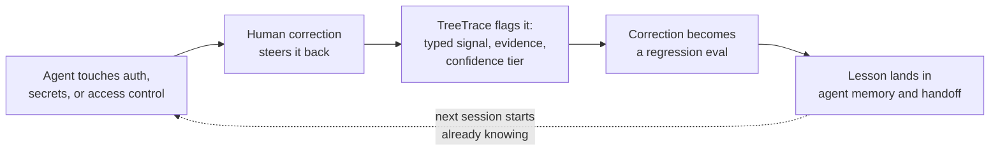

# TreeTrace

[](https://www.npmjs.com/package/treetrace)
[](https://github.com/Tree-Trace/treetrace/actions/workflows/ci.yml)
[](LICENSE)
[](package.json)

**Git shows what changed. TreeTrace shows how you steered the agent.**


TreeTrace is the local-first regression and memory layer for AI coding agents. It reads local AI coding transcripts and reconstructs the path of human steering: the root goal, direction changes, corrections, abandoned branches, accepted decisions, and the final shipped path. The sharpest signal is security. TreeTrace flags every time an agent touched auth, secrets, or access control, disabled tests, ran unsafe shell, or opened an SSRF, RCE, or XSS path, captures the human correction that pulled it back, and turns that correction into a regression eval so the next agent does not repeat it.

Website: [treetrace.dev](https://treetrace.dev)

It then exports:

- `TREETRACE_REPORT.md` as the combined human-readable report
- `PROMPT_TREE.md` for humans
- `.treetrace/tree.json` for tools
- `.treetrace/failures.json` for agent mistake analysis
- `.treetrace/lessons.md` for reusable correction memory
- `.treetrace/evals.jsonl` for regression and eval harnesses
- `.treetrace/agent-memory.md` for future coding agents
- `treetrace --handoff` for the next agent

```bash
cd your-project
npx treetrace
```

No accounts. No uploads. No telemetry. Your transcripts never leave your machine.

## Requirements

Node.js 18 or newer. TreeTrace ships with no runtime dependencies, so `npx treetrace` needs nothing else installed.

## Why

Git history shows what changed. TreeTrace shows how the human had to steer the agent to get there.

AI coding sessions contain the most useful regression data teams have: where the model misunderstood the goal, which correction fixed it, which branch was abandoned, what constraint kept getting ignored, and what should become an eval so the next agent does not repeat the failure.

TreeTrace is the local-first layer between raw chat logs, runtime traces, and code provenance.

## Security regression memory

Agents drift into the dangerous places: editing auth flows, printing secrets, loosening access control, deleting or skipping tests, running shell that touches the network, or wiring up an SSRF, RCE, or XSS path. The moment that matters is the human correction right after, the steer that pulled the agent back. Git keeps the final diff but loses that steer. TreeTrace keeps both.

The loop is explicit:



1. **Failure.** TreeTrace flags the risky agent action with a typed signal (for example `security_or_privacy_risk`), a confidence score, the evidence text, and the source node IDs.
2. **Eval.** The human correction that resolved it becomes a model-agnostic case in `.treetrace/evals.jsonl`, so the same mistake is caught next time in CI or an eval harness.
3. **Handoff.** The lesson lands in `.treetrace/agent-memory.md` and `treetrace --handoff`, so the next agent starts already knowing the constraint instead of relearning it.

Failure to eval to handoff: every correction you made by hand becomes a guardrail the next session inherits.

## What it does

1. **Discovers local transcripts.** Claude Code session files are found automatically from `~/.claude/projects/...`; plain transcripts can be imported with `--file` or `--stdin`.
2. **Extracts prompt lineage.** Tool noise, slash-command wrappers, sidechain chatter, duplicate resends, and "continue" nudges are filtered or folded.
3. **Builds a fork-aware tree.** Corrections, scope changes, checkpoints, questions, abandoned branches, and accepted paths are derived from prompt topology and user text.
4. **Analyzes failures and corrections.** TreeTrace adds failure signals, correction chains, lessons, and eval candidates using transparent heuristics.
5. **Exports regression artifacts.** JSON, Markdown, JSONL, and handoff memory are written locally for agents, CI, eval harnesses, and humans.
6. **Gates every export with redaction.** Detected secrets must be resolved before anything is written; non-interactive runs redact automatically and shadow-scan rendered output.

## Outputs

| Artifact | Purpose |
|----------|---------|
| `TREETRACE_REPORT.md` | Combined human-readable report for review, terminals, and chat handoff |
| `PROMPT_TREE.md` | Human-readable narrative of the build path |
| `.treetrace/tree.json` | Canonical machine-readable lineage schema |
| `.treetrace/failures.json` | Failure signals, correction chains, and summaries |
| `.treetrace/lessons.md` | Human-readable lessons for future work |
| `.treetrace/evals.jsonl` | Generic model-agnostic eval cases |
| `.treetrace/agent-memory.md` | Compact memory pack for Codex, Claude Code, Cursor, or another agent |
| `treetrace --handoff` | Agent-ready continuation brief printed to stdout |

## Usage

| Command | What it does |
|---------|--------------|
| `npx treetrace` | Trace this project and write all artifacts |
| `npx treetrace --report` | Write all artifacts and print the human report |
| `npx treetrace --handoff` | Print an agent ready continuation brief |
| `npx treetrace --file session.jsonl` | Import specific session or transcript files (format auto-detected) |
| `npx treetrace --from chatgpt --file conversations.json` | Import another tool's export with an explicit format |
| `npx treetrace --stdin < chat.txt` | Parse a pasted `User:` / `Assistant:` transcript |
| `npx treetrace --failures` | Write and print `.treetrace/failures.json` |
| `npx treetrace --lessons` | Write and print `.treetrace/lessons.md` |
| `npx treetrace --evals` | Write and print `.treetrace/evals.jsonl` |
| `npx treetrace --memory` | Write and print `.treetrace/agent-memory.md` |
| `npx treetrace --titles-only` | Compact human tree, no full prompt details |
| `npx treetrace --redact-auto` | Redact every detected secret without prompting |
| `npx treetrace --since 2026-06-01` | Limit to sessions on or after a date |

For a Terminus, Codex CLI, Claude Code, or SSH session where you want the report in the terminal window, use:

```bash
npx treetrace --report --redact-auto
```

For both terminal output and an extra shell-captured copy:

```bash
npx treetrace --report --redact-auto | tee treetrace-output.md
```

If you see a file literally named `output`, that usually came from `--out output` or shell redirection like `> output`. Prefer `TREETRACE_REPORT.md` for human reading and leave `.treetrace/*.json` / `.jsonl` for tools.

## Failure analysis

TreeTrace does not claim to perfectly understand every session. The first analysis pass is heuristic and explainable: every failure signal includes a type, confidence score, evidence text, and source node IDs.

Initial failure types include:

- `ignored_constraint`
- `misunderstood_goal`
- `scope_drift`
- `wrong_tool_choice`
- `hallucinated_file_or_api`
- `repeated_failed_fix`
- `overbuilt_solution`
- `underbuilt_solution`
- `security_or_privacy_risk`
- `dependency_or_environment_mismatch`
- `format_violation`
- `user_frustration`
- `abandoned_path`

The goal is not judgment. The goal is regression memory: identify what future agents should preserve, avoid, or test.

## Eval export

`.treetrace/evals.jsonl` turns real session corrections into generic eval cases:

```json
{"id":"eval_001","source":"treetrace","type":"scope_drift_detection","task":"Continue development without drifting outside the corrected scope.","expected_behavior":["Stay inside the corrected scope","Do not add unrequested product surfaces"],"sourceNodeIds":["node_002","node_003"]}
```

The format is intentionally model-agnostic. Adapters for promptfoo, OpenAI Evals-style harnesses, LangSmith-style datasets, and other eval systems can build from this JSONL without changing TreeTrace's local-first core.

## Redaction gate

A privacy-positioned tool gets exactly one chance with your secrets, so every export goes through the same gate:

- Curated provider rules for AWS, GitHub, GitLab, Anthropic, OpenAI, Slack, Stripe, npm, Tailscale, Google, SendGrid, Twilio, Telegram, Discord webhooks, JWTs, private key blocks, WireGuard keys, basic-auth URLs, bearer tokens, and secret assignments.
- High-entropy fallback for unknown token shapes.
- Detection for common line-wrapped provider tokens.
- Interactive review of every unique hit in a TTY.
- Automatic redaction outside a TTY.
- Shadow scan of the rendered artifact before write.
- `.treetrace/redactions.json` stores only content hashes and actions, never raw secrets.

## Sources

TreeTrace reads Claude Code automatically and imports other tools through `--file`.
When you pass a `.json` or `.jsonl` file, the format is auto-detected; you can
also force it with `--from <tool>`. Everything stays local and passes the same
redaction gate. The generic `User:` / `Assistant:` transcript parser remains the
fallback for anything unrecognized.

Verified means the adapter was validated against real session or real published
export data. Experimental means it was built to the tool's documented export
schema and validated against a fixture in that exact shape, but not yet against a
captured real session on a contributor's machine. See
[test/fixtures/adapters/PROVENANCE.md](test/fixtures/adapters/PROVENANCE.md) for
the source of every fixture.

| Source | `--from` | Status |
|--------|----------|--------|
| Claude Code (`~/.claude/projects` JSONL) | `claude` | Built-in, zero-config, verified |
| Codex CLI (`~/.codex/sessions/.../rollout-*.jsonl`) | `codex` | Verified against a real session |
| ChatGPT / OpenAI account export (`conversations.json`) | `chatgpt` | Verified against a real published export sample |
| Google Gemini CLI session (ChatRecordingService JSON) | `gemini` | Verified against the real gemini-cli session file |
| GitHub Copilot Chat session (`chatSessions/*.json`) | `copilot` | Verified against a real published session sample |
| Cursor exported chat JSON | `cursor` | Verified against the export schema (see note) |
| xAI Grok exported conversation JSON | `grok` | Experimental, built to the exporter schema |
| Pasted / plain-text transcripts (`User:` / `Assistant:`) | `transcript` | Built-in fallback |

### Why TreeTrace does not read SQLite

Cursor stores its chat in a `state.vscdb` SQLite database, and the common Grok
CLI keeps history in SQLite as well. That raw database is rich: it holds real
file diffs, reasoning, rejected edits, and attached-file context. TreeTrace
deliberately does not read it, because the zero-runtime-dependency promise is a
feature, not an accident. Nothing extra to install, a smaller supply-chain and
attack surface, and a tool that a privacy-conscious or security team can audit in
one sitting matter more right now than the extra signal. Adding an optional
SQLite reader is a future option we are choosing not to take yet.

So the Cursor adapter ingests an exported chat JSON instead. Export your Cursor
chat to JSON first (for example with a community Cursor chat exporter), then run
`treetrace --from cursor --file your-chat.json`. The Grok adapter targets the
exported conversation JSON used by Grok CLI tools (the xAI OpenAI-compatible
`role` / `content` message shape); it stays experimental until validated against
a captured real Grok session.

## Schema

`.treetrace/tree.json` uses the open TreeTrace v0.2 schema documented in [SCHEMA.md](SCHEMA.md). It is designed to compose with Agent Trace: Agent Trace can describe which lines were AI-generated, while TreeTrace describes the human instruction lineage that shaped the build.

Consumers should ignore unknown fields. Failure signals, correction chains, lessons, and eval candidates are additive.

## Product boundaries

TreeTrace is not a hosted SaaS, telemetry product, generic LangSmith clone, prompt-sharing network, or graph visualizer first.

The strongest identity is:

> local, private, structured, eval-ready, agent-aware.

## License

Apache License 2.0 (Apache-2.0).

Copyright 2026 Zion Boggan.

You may use, modify, and distribute TreeTrace for any purpose, including commercial use, and the license includes an explicit patent grant. See [LICENSE](LICENSE) for the full terms.

---

See [examples/](examples/) for a full set of generated artifacts. The Markdown tree is one artifact among several: the main product is structured, local, eval-ready knowledge about how agents fail and how humans correct them.
